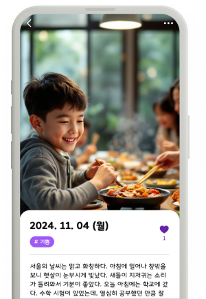
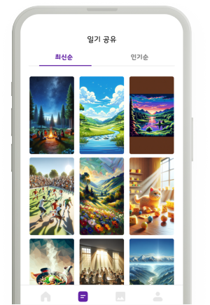
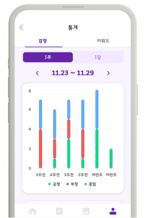

# Canvas Diary
홍익대학교 졸업 프로젝트

## 👥 팀원 소개
<table >
  <tbody>
        <td align="center">
        <a href="https://github.com/leve68">
            
<h3><b>한승연</b></h3></a></td>
  </tbody>
</table>

## 🛠️ Tech Stacks

### Cowork Tools

### Development

### Test

### Deploy

### ETC

  <h3>온보딩 화면</h3>
  <table>
    <tr>
      <td align="center">
         
        날짜를 클릭해 일기를 작성하거나 확인하세요
      </td>
      <td align="center">
         
        일기를 작성하면 AI가 감정을 분석하고 관련 이미지를 생성합니다
      </td>
    </tr>
    <tr>
      <td align="center">
         
        다른 사람들의 일기를 통해 새로운 이야기를 만나보세요
      </td>
      <td align="center">
         
        내 일기의 감정과 키워드를 분석한 통계를 확인하세요
      </td>
    </tr>
  </table>

## 🔗 링크 모음
### 영상
[Youtube](https://www.youtube.com/watch?v=MRZT8lt0FgI)

